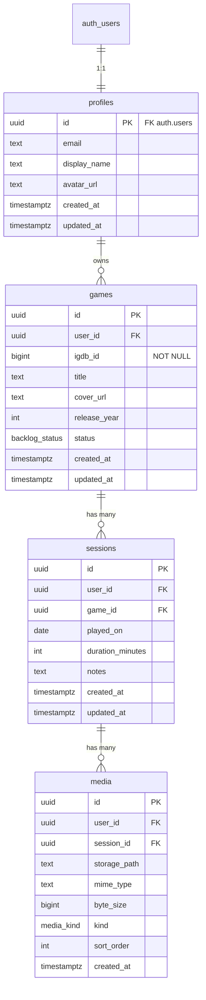

# GameLog — Entity Relationship Diagram (ERD)

**Status:** Design locked (499A catch-up)  
**Aligned with:** Final Requirements Specification (MH-1–MH-8; ST hooks)  
**Existing schema:** `profiles` (migration `20250616120000_create_profiles.sql`)  
**Decisions:** defaults from design review — see [Locked decisions](#locked-decisions)

---

## Overview

GameLog stores a **private, per-user** game library, play sessions, and session media. There is no shared catalog or social graph.

```
auth.users ──1:1── profiles ──1:N── games ──1:N── sessions ──1:N── media
                                              │
                                              └── blobs in Storage bucket
                                                  (path recorded on media)
```

| Entity | Role |
| --- | --- |
| `profiles` | App-facing user row (1:1 with Supabase Auth) |
| `games` | One row per game **in this user’s library** (IGDB metadata snapshot + backlog status) |
| `sessions` | Journal entries belonging to exactly one library game |
| `media` | Screenshot (MVP) or video (stretch) metadata; file bytes in Storage |

---

## Diagram



---

## Locked decisions

| Topic | Choice |
| --- | --- |
| Library table name | `games` |
| Duplicate IGDB title per user | **Forbidden** — `UNIQUE (user_id, igdb_id)` |
| Manual add without IGDB | **Out of MVP** — `igdb_id` is `NOT NULL` |
| Status storage | Postgres enum `backlog_status` |
| `user_id` on `sessions` / `media` | **Denormalized** (simplifies RLS) |
| Media table name | `media` |
| Video stretch | Column `kind` includes `video` now; MVP rows use `image` only |

---

## Enums

### `backlog_status`

| DB value | UI label |
| --- | --- |
| `wishlist` | Wishlist |
| `in_progress` | In Progress |
| `on_hold` | On Hold |
| `completed` | Completed |
| `dropped` | Dropped |

Exactly one status per `games` row (MH-3).

### `media_kind`

| DB value | Used when |
| --- | --- |
| `image` | Screenshots (MH-6) |
| `video` | Short clips (ST-3) |

---

## Tables

### 1. `profiles` (exists)

Unchanged from current migration.

| Column | Type | Notes |
| --- | --- | --- |
| `id` | `uuid` PK | FK → `auth.users(id)` ON DELETE CASCADE |
| `email` | `text` | |
| `display_name` | `text` | |
| `avatar_url` | `text` | |
| `created_at` | `timestamptz` NOT NULL | default `now()` |
| `updated_at` | `timestamptz` NOT NULL | default `now()` |

RLS: select/update own row only. Trigger `handle_new_user` creates the row on signup.

---

### 2. `games`

Personal library entry. Not a global IGDB cache.

| Column | Type | Notes |
| --- | --- | --- |
| `id` | `uuid` PK | `gen_random_uuid()` |
| `user_id` | `uuid` NOT NULL | FK → `profiles(id)` ON DELETE CASCADE |
| `igdb_id` | `bigint` NOT NULL | IGDB game id (MH-4) |
| `title` | `text` NOT NULL | Snapshot at add time |
| `cover_url` | `text` | Nullable if IGDB has no cover |
| `release_year` | `integer` | Nullable |
| `status` | `backlog_status` NOT NULL | default `wishlist` (or app-chosen) |
| `created_at` | `timestamptz` NOT NULL | default `now()` |
| `updated_at` | `timestamptz` NOT NULL | default `now()` |

**Constraints**

- `UNIQUE (user_id, igdb_id)` — one library row per IGDB game per user.
- FK cascade: deleting a profile deletes that user’s games.

**Indexes**

- `(user_id)`
- `(user_id, status)` — library filter (MH-7), dashboard counts (MH-8)
- `(user_id, updated_at DESC)` — optional recent-activity ordering

---

### 3. `sessions`

Play journal entry; belongs to exactly one `games` row (MH-5).

| Column | Type | Notes |
| --- | --- | --- |
| `id` | `uuid` PK | |
| `user_id` | `uuid` NOT NULL | FK → `profiles(id)` ON DELETE CASCADE; denormalized for RLS |
| `game_id` | `uuid` NOT NULL | FK → `games(id)` ON DELETE CASCADE |
| `played_on` | `date` NOT NULL | Calendar play date |
| `duration_minutes` | `integer` NOT NULL | `CHECK (duration_minutes >= 0)` |
| `notes` | `text` NOT NULL | default `''`; unbounded length |
| `created_at` | `timestamptz` NOT NULL | |
| `updated_at` | `timestamptz` NOT NULL | |

**Integrity**

- App (and optionally a trigger) must ensure `sessions.user_id` matches `games.user_id` for `game_id`.
- Deleting a game deletes all of its sessions (MH-3).
- Deleting a session does **not** delete the game.

**Indexes**

- `(game_id, played_on DESC)` — sessions for a game, newest first (MH-5)
- `(user_id, played_on DESC)` — date-range filter + 7-day / lifetime counts (MH-7, MH-8)
- `(user_id, game_id, played_on DESC)` — filter by game + date (MH-7)

---

### 4. `media`

Metadata for files attached to a session (MH-6; ST-3).

| Column | Type | Notes |
| --- | --- | --- |
| `id` | `uuid` PK | |
| `user_id` | `uuid` NOT NULL | FK → `profiles(id)` ON DELETE CASCADE |
| `session_id` | `uuid` NOT NULL | FK → `sessions(id)` ON DELETE CASCADE |
| `storage_path` | `text` NOT NULL | Object key in bucket |
| `mime_type` | `text` NOT NULL | e.g. `image/png`, `image/jpeg` |
| `byte_size` | `bigint` NOT NULL | `CHECK (byte_size > 0)` |
| `kind` | `media_kind` NOT NULL | default `image` |
| `sort_order` | `integer` NOT NULL | default `0`; gallery order |
| `created_at` | `timestamptz` NOT NULL | |

**Rules**

- Deleting one `media` row does not delete the session.
- Deleting a session (or its parent game) cascades to media rows; app should also remove Storage objects.
- Soft 50 MB **per session** total is enforced in the application (sum of `byte_size` for that `session_id`); optional DB trigger later.

**Indexes**

- `(session_id, sort_order)`
- `(user_id)`

**Suggested Storage path**

```text
{user_id}/{session_id}/{media_id}.{ext}
```

---

## Storage (not a Postgres table)

| Item | Value |
| --- | --- |
| Bucket | `session-media` (private) |
| Access | Authenticated users may read/write/delete only objects under `{auth.uid()}/…` |
| Public URLs | Prefer signed URLs or authenticated download; do not make the bucket public |

---

## Row Level Security (target policies)

All app tables: **enable RLS**. Authenticated role only.

| Table | Policy intent |
| --- | --- |
| `profiles` | SELECT / UPDATE where `auth.uid() = id` (already implemented) |
| `games` | ALL where `auth.uid() = user_id` |
| `sessions` | ALL where `auth.uid() = user_id` |
| `media` | ALL where `auth.uid() = user_id` |

No cross-user SELECT policies (MH-2). Service role is reserved for server admin tasks, not the browser client.

---

## Cascade summary

| Action | Effect |
| --- | --- |
| Delete `auth.users` / `profiles` | Cascades to `games` → `sessions` → `media` |
| Delete `games` row | Cascades to that game’s `sessions` → `media` (MH-3) |
| Delete `sessions` row | Cascades to that session’s `media` (MH-5/MH-6) |
| Delete `media` row | Session remains; remove Storage object in app |

---

## Requirement mapping

| Req | Supported by |
| --- | --- |
| MH-1 Auth | `profiles` + Supabase Auth (existing) |
| MH-2 Privacy | `user_id` + RLS on `games` / `sessions` / `media` |
| MH-3 Library CRUD + statuses | `games` + `backlog_status` + CASCADE |
| MH-4 IGDB fields | `igdb_id`, `title`, `cover_url`, `release_year` |
| MH-5 Sessions | `sessions.played_on`, `duration_minutes`, `notes` |
| MH-6 Screenshots | `media` + Storage; per-row delete |
| MH-7 Filters | Indexes on `status`, `game_id`, `played_on` |
| MH-8 Dashboard | Aggregates on `games.status` and `sessions.played_on` |
| ST-1 Full-text | Future `tsvector` / generated columns; no table change required now |
| ST-2 JSON export | Read user’s rows; `storage_path` as media reference |
| ST-3 Video | `media.kind = video` + mime/size checks in app |
| ST-4 Stale nudges | Query `in_progress` games with max(`played_on`) older than 7 days |

---

## Out of scope for this ERD

- Global / shared `igdb_games` cache table  
- Platforms, tags, ratings, friends, sharing  
- Soft deletes / audit history  
- Manual library entries without `igdb_id` (deferred fallback if IGDB fails in 499B)  
- Separate dashboard or search tables  

---

## Implementation notes (next migrations)

1. Create enums `backlog_status`, `media_kind`.  
2. Create `games`, `sessions`, `media` with FKs, uniques, checks, indexes.  
3. Enable RLS + CRUD policies on each.  
4. Optional: `updated_at` trigger shared with `profiles`.  
5. Create Storage bucket `session-media` + path-scoped policies.  
6. Keep `igdb_id NOT NULL` until a deliberate manual-add fallback is added.

---

## Document history

| Date | Change |
| --- | --- |
| 2026-07-17 | Initial ERD locked to Final Requirements Spec defaults |
